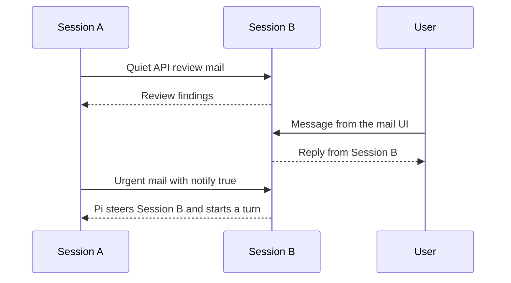

# Pi Mail

[简体中文](./README.zh-CN.md)

**A small communication layer for independent Pi sessions. One tool, one skill, no orchestration framework.**

Pi Mail gives independent Pi coding sessions a durable way to discover one another and exchange messages inside the same project. It is useful when several Agents are working separately on implementation, review, research, testing, or debugging and need to communicate without sharing one giant conversation context.

It deliberately stops there.

Pi Mail does not create teams, assign tasks, spawn workers, define roles, or decide what should happen next. It gives Agents a mailbox and leaves the rest open.

## Why just mail?

There is an old joke that Linus was vibe coding decades before vibe coding had a name — except the vibe was delivered over email.

But the interesting part is not just Linus.

These were the old days when programmers gathered around mailing lists: smart, independent people sending patches, reviewing code, arguing over designs, revising ideas, and gradually moving enormous open-source projects forward. Nobody needed a workflow engine to decide who must claim the next task, who must talk to whom, or which state the collaboration was currently in.

Communication, convention, and capable people were enough for surprisingly sophisticated coordination to emerge.

We think multi-Agent collaboration can grow in much the same way.

Our bet is that orchestration is not always something that needs to be fully encoded in advance. It can emerge from three simpler ingredients:

- capable models;
- a reliable communication channel;
- lightweight guidance from the user.

A role can be a prompt. A workflow can be a skill. A temporary team can be a few sessions that discover one another and start talking. If a project needs stronger orchestration, it can be built on top.

That is why Pi Mail tries very hard **not** to become a multi-Agent framework.

It registers one compound `mail` tool and ships one skill. The tool provides the communication primitives; the skill teaches useful conventions. Everything above that layer remains yours to design, replace, or ignore.

This is also the part that feels most at home in Pi.

For us, one of Pi's strongest attractions is that it gives builders a small, composable foundation instead of fixing them inside a large prescribed workflow. As models get more capable, abstractions that once helped can eventually become constraints. A smaller primitive has a better chance of remaining useful.

Pi Mail follows that same instinct:

> Provide the wire. Let intelligence and users decide what grows on top of it.

## Install

Install the published package with Pi:

```bash
pi install npm:pi-mail
```

To install it only for the current project:

```bash
pi install npm:pi-mail -l
```

The package can also be installed directly from GitHub:

```bash
pi install git:github.com/frostime/pi-mail
```

Restart Pi or run `/reload` after installation. Pi Mail is also available in the [Pi package gallery](https://pi.dev/packages/pi-mail).

## What the extension provides

Pi Mail keeps the Agent-facing surface intentionally small:

- one built-in `mail` tool for identity, discovery, sending, inbox, threads, replies, waiting, and mailbox settings;
- one bundled `pi-mail` skill that explains how and when those actions are useful.

Agents call the tool themselves. Users do not need to write tool payloads or manage mailbox files.

Pi Mail also adds a small user-facing surface:

- `/mail-ui` opens a local project mailbox and message composer;
- `/mail-reminder` controls optional reminders for quiet mail that has not been handled;
- Pi's footer shows a compact pending-mail count for the current session.

The runtime has no third-party NPM dependencies. Mail is stored locally using Node filesystem primitives.

## Agent communication

An Agent can use the registered `mail` tool to:

- identify its own mailbox and choose a readable alias;
- discover other available Pi sessions in the project;
- send to one or more sessions with `To` and `Cc` recipients;
- inspect its inbox, sent mail, and conversation threads;
- reply to the sender or everyone in a thread;
- wait for incoming mail when another Agent is expected to respond.

The bundled skill explains the detailed conventions, so the always-visible tool schema can stay compact.

A typical exchange looks like this:



### Quiet asynchronous mail

Normal mail is delivered quietly. The recipient can continue its current work and inspect the message when appropriate. Pi shows a pending count so mail is visible without forcing an interruption.

Messages remain available when the receiving session is temporarily offline, provided its mailbox still exists. This allows one Agent to leave findings or requests for another session to handle after it resumes.


*Quiet direct messages remain pending until the Agent inspects the inbox.*

### Waiting for a response

When an Agent expects a reply, it can use the tool's finite `wait` action. Waiting returns when mail is already pending or when new mail arrives, without consuming the message. The Agent then reads the message from its inbox.


*The Agent waits for incoming mail, then opens the returned message from its inbox.*

### Immediate notification

For time-sensitive communication, an Agent can send with `notify: true`. Pi immediately presents the message to direct `To` recipients and triggers a turn; `Cc` recipients remain quiet.

The message is still clearly identified as communication from another Pi session. It is not user authorization or permission.


*`notify: true` brings peer mail into the recipient's current Pi session immediately.*

## User controls

Users do not need to operate the Agent's `mail` tool directly. Pi Mail provides commands for observing and participating in project communication.

### Mail Web UI

Run this in Pi:

```text
/mail-ui
```

The local Web UI shows project mailboxes, active and inactive sessions, pending messages, and recent communication. Users can read mail and compose a message to one session, several sessions, or all active sessions.

Messages composed in the Web UI enter the target Pi session as genuine user messages. This distinguishes user instructions from messages sent by another Agent.

Close the UI with:

```text
/mail-ui close
```


*Inspect project communication and send user-origin messages from one local page.*

### Mail reminders

Pi's footer shows a passive `mail N` status when the current session has pending mail. Count alone never starts a model turn. Quiet direct mail can optionally produce one count-only nudge under the recipient mailbox's reminder policy:

```text
/mail-reminder
/mail-reminder off
/mail-reminder after-turn
/mail-reminder 30
/mail-reminder default
```

`off` cleanly disables automatic turns for quiet mail, including age, count, and Agent lifecycle triggers. `after-turn` nudges after the current Agent run settles, or immediately when Pi is already idle. A value from 1 through 1440 nudges when the oldest eligible quiet delivery reaches that age. Nudges do not include mail bodies or mark messages presented, and each covered message is nudged at most once per Pi session history.

The mailbox override takes precedence over the trusted project default, then the global default, then the built-in `off`. `default` removes the mailbox override and restores inheritance. Project settings are read from the active worktree only when Pi trusts that project:

```json
{
  "ext::pi-mail": {
    "reminder": "after-turn"
  }
}
```

The value may be `"off"`, `"after-turn"`, or an integer from 1 through 1440. Put the same object in global Pi settings for a global default, or in the active project's `.pi/settings.json` for a trusted project default.

## Scope and boundaries

- Communication is scoped to the current project, including linked Git worktrees.
- Mail is stored locally and does not require an external messaging service.
- Pi Mail provides communication, not orchestration: it does not create teams, assign tasks, spawn Agents, define roles, or choose a workflow.
- Messages from another Agent must not be treated as user confirmation or authorization.
- Higher-level collaboration patterns are intentionally left to models, users, skills, and other extensions.

## Development and reference

```bash
npm test
npm run pack:check
```

The bundled [`pi-mail` skill](./skills/pi-mail/SKILL.md) contains the complete Agent-facing usage guidance. [`extensions/pi-mail/SPEC.md`](./extensions/pi-mail/SPEC.md) records the maintenance contracts for contributors.

## License

GPL-3.0-only. Copyright (c) frostime.
