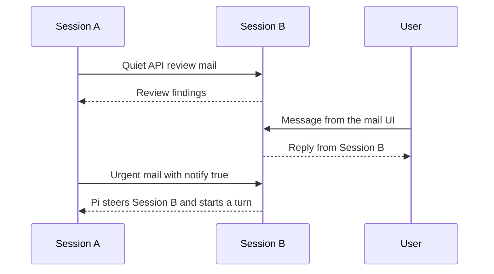

# Pi Mail

[简体中文](./README.zh-CN.md)

**A local infrastructure layer for multi-agent communication across Pi sessions.**

Pi Mail lets independent Pi sessions in the same project exchange messages. It is useful when several Agents are working separately on implementation, review, research, testing, or debugging and need a durable way to communicate without merging their conversations.

## Install

Install the published package with Pi:

```bash
pi install npm:pi-mail
```

To install it only for the current project:

```bash
pi install npm:pi-mail -l
```

The package can also be installed directly from GitHub:

```bash
pi install git:github.com/frostime/pi-mail
```

Restart Pi or run `/reload` after installation. Pi Mail is also available in the [Pi package gallery](https://pi.dev/packages/pi-mail).

## What the extension provides

Pi Mail adds two Agent-facing components to Pi:

- A built-in `mail` tool for discovering sessions, sending and receiving messages, replying in threads, and waiting for new mail.
- A bundled `pi-mail` skill that teaches the Agent when and how to use every mail action.

Agents call the tool themselves. Users do not need to write tool payloads or manage mailbox files.

Pi Mail also adds user-facing controls:

- `/mail-ui` opens a local project mailbox and message composer.
- `/mail-reminder` controls reminders for quiet mail that has not been handled.
- Pi's footer shows a compact pending-mail count for the current session.

## Agent communication

An Agent can use the registered `mail` tool to:

- identify its own mailbox and choose a readable alias;
- discover other available Pi sessions in the project;
- send to one or more sessions with `To` and `Cc` recipients;
- inspect its inbox, sent mail, and conversation threads;
- reply to the sender or everyone in a thread;
- wait for incoming mail when another Agent is expected to respond.

The bundled skill explains these actions to the Agent, so it can select and call them as part of its work.

A typical exchange looks like this:



### Quiet asynchronous mail

Normal mail is delivered quietly. The recipient can continue its current work and inspect the message when appropriate. Pi shows a pending count so mail is visible without forcing an interruption.

Messages remain available when the receiving session is temporarily offline, provided its mailbox still exists. This allows one Agent to leave findings or requests for another session to handle after it resumes.


*Quiet direct messages appear as pending mail; the Agent uses its inbox to inspect them.*

### Waiting for a response

When an Agent expects a reply, it can use the tool's finite `wait` action. Waiting returns when mail is already pending or when new mail arrives, without consuming the message. The Agent then reads the message from its inbox.


*The Agent waits for incoming mail, then opens the returned message from its inbox.*

### Immediate notification

For time-sensitive communication, an Agent can send with `notify: true`. Pi immediately presents the message to direct `To` recipients and triggers a turn; `Cc` recipients remain quiet.

The message is still clearly identified as communication from another Pi session. It is not user authorization or permission.


*`notify: true` brings peer mail into the recipient's current Pi session immediately.*

## User controls

Users do not need to operate the Agent's `mail` tool directly. Pi Mail provides commands for observing and participating in project communication.

### Mail Web UI

Run this in Pi:

```text
/mail-ui
```

The local Web UI shows project mailboxes, active and inactive sessions, pending messages, and recent communication. Users can read mail and compose a message to one session, several sessions, or all active sessions.

Messages composed in the Web UI enter the target Pi session as genuine user messages. This distinguishes user instructions from messages sent by another Agent.

Close the UI with:

```text
/mail-ui close
```


*Inspect project communication and send user-origin messages from one local page.*

### Mail reminders

Pi's footer shows a compact `mail N` status when the current session has pending mail. Users can also enable a reminder when quiet direct mail has remained unhandled for a chosen number of minutes:

```text
/mail-reminder 30
/mail-reminder off
```

Reminders are disabled by default.

## Scope and boundaries

- Communication is scoped to the current project, including linked Git worktrees.
- Mail is stored locally and does not require an external messaging service.
- Pi Mail provides communication, not orchestration: it does not create teams, assign tasks, spawn Agents, or choose a workflow.
- Messages from another Agent must not be treated as user confirmation or authorization.

## Development and reference

```bash
npm test
npm run pack:check
```

The bundled [`pi-mail` skill](./skills/pi-mail/SKILL.md) contains the complete Agent-facing usage guidance. [`extensions/pi-mail/SPEC.md`](./extensions/pi-mail/SPEC.md) records the maintenance contracts for contributors.

## License

GPL-3.0-only. Copyright (c) frostime.
