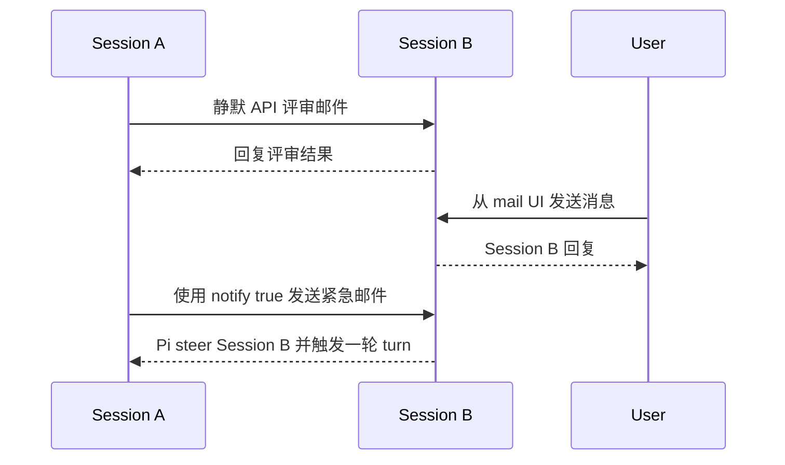

# Pi Mail

[English](./README.md)

**为彼此独立的 Pi session 提供一层很小的通信基础设施。一个 tool，一个 skill，不做编排框架。**

Pi Mail 让同一项目中的独立 Pi coding session 可以互相发现并持久地交换消息。多个 Agent 分别负责实现、评审、调研、测试或问题排查时，可以通过它保持联系，而不需要把所有上下文塞进同一段巨大的对话。

然后，就到此为止。

Pi Mail 不创建 team，不分配 task，不启动 worker，不定义 role，也不决定接下来该由谁做什么。它只是给 Agent 一套邮箱，然后把剩下的空间留出来。

## Why just mail?

互联网上有个老梗：Linus 在 “vibe coding” 这个词出现几十年前，就已经开始 vibe coding 了——只不过他的 vibe 是通过 email 发送的。

但真正有意思的并不只是 Linus。

那是程序员围绕 mailing list 协作的年代。很多聪明、独立的人通过邮件发送 patch、review 代码、争论设计、修改方案，然后一点点把规模惊人的开源项目共同推进下去。没有一个 workflow engine 站在旁边规定：现在谁必须认领下一个 task、谁必须和谁通信、整个协作现在应该进入哪个状态。

简单的通信、共同形成的约定，以及参与者自身的能力，已经足以让复杂而优雅的协作自然生长出来。

我们相信，Multi-Agent 的协作也可以沿着类似的方向发展。

我们的一个基本判断是：**编排不一定需要被完整地预先编码出来。** 它可以从三个更基础的东西上涌现：

- 足够有能力的模型；
- 一个可靠的通信渠道；
- 用户提供的轻量引导。

Role 可以只是一段 prompt，workflow 可以只是一份 skill，一个临时 team 也可以只是几个彼此发现、开始通信的 session。如果某个项目确实需要更强的 orchestration，那么完全可以继续构建在这一层之上。

这也正是 Pi Mail 刻意避免变成 Multi-Agent framework 的原因。

我们只注册一个复合型的 `mail` tool，再提供一个 skill。Tool 提供通信原语，skill 提供默认的使用约定。再往上的部分，应该由用户自己设计、替换、组合，甚至完全忽略。

这也是我们觉得 Pi Mail 和 Pi 本身最有“精神共鸣”的地方。

对我们而言，Pi 很重要的一种吸引力，在于它给喜欢自己构建的人提供一个小而可组合的基础，而不是预先把他们固定在庞大的工作流里。模型会继续变聪明；一些今天看起来必要的限制，未来很可能反而变成约束。越基础、越正交的 primitive，越有机会在模型能力继续增长以后仍然保持价值。

Pi Mail 延续的就是这种直觉：

> 只提供那根线。至于线上最终会长出什么，让智能本身和用户来决定。

## 安装

使用 Pi 安装已经发布的 package：

```bash
pi install npm:pi-mail
```

如果只想在当前项目中安装：

```bash
pi install npm:pi-mail -l
```

也可以直接从 GitHub 安装：

```bash
pi install git:github.com/frostime/pi-mail
```

安装后重启 Pi，或执行 `/reload`。Pi Mail 也可以在 [Pi package gallery](https://pi.dev/packages/pi-mail) 中找到。

## 这个 extension 提供什么

Pi Mail 刻意把 Agent 侧的接口压得很小：

- 一个内置的 `mail` tool，用于身份、发现、发送、收件箱、thread、回复、等待和邮箱设置；
- 一个随包安装的 `pi-mail` skill，用于解释这些 action 在什么场景下值得使用，以及具体如何调用。

这些 tool 调用由 Agent 自己完成。用户不需要手写 tool 参数，也不需要管理邮箱文件。

Pi Mail 同时只提供少量用户侧能力：

- `/mail-ui` 打开当前项目的本地邮箱和写信界面；
- `/mail-reminder` 设置静默邮件长时间未处理时的可选提醒；
- Pi 底部状态栏显示当前 session 的待处理邮件数量。

运行时不依赖第三方 NPM 包，邮件只使用 Node 文件系统能力保存在本地。

## Agent 如何通信

Agent 可以使用注册到 Pi 中的 `mail` tool：

- 查看自己的邮箱身份，并设置易读的 alias；
- 发现当前项目中的其他 Pi session；
- 使用 `To` 和 `Cc` 给一个或多个 session 发消息；
- 查看收件箱、已发送邮件和 conversation thread；
- 回复发件人，或回复 thread 中的所有参与者；
- 在等待另一个 Agent 回复时监听新邮件。

更详细的使用约定由随包提供的 skill 负责，因此常驻的 tool schema 可以保持紧凑。

一个典型流程如下：



### 静默异步通信

普通邮件默认静默投递。收件方可以继续当前工作，在合适的时候再查看消息。Pi 会显示待处理数量，让邮件保持可见，但不会强制打断 Agent。

只要收件方的 mailbox 仍然存在，即使对应 session 暂时离线，邮件也会保留下来。一个 Agent 可以先留下结论或请求，等另一个 session 恢复后再处理。


*静默直接邮件会显示为待处理邮件，Agent 通过 inbox 查看具体内容。*

### 等待回复

如果 Agent 正在等待另一个 session 回复，可以使用 tool 中有限时长的 `wait` action。邮箱中已经有待处理邮件，或等待期间收到新邮件时，`wait` 都会返回，但不会消费邮件；Agent 随后再从 inbox 中读取内容。


*Agent 等待新邮件到达，然后从 inbox 中打开对应消息。*

### 立即提醒

遇到有时效性的消息时，Agent 可以使用 `notify: true` 发送。Pi 会立即把消息呈现给直接 `To` 收件人并触发一轮 turn；`Cc` 收件人仍然保持静默。

这条消息依然会被明确标记为来自另一个 Pi session，而不是用户授权或 permission。


*`notify: true` 会立即把 session 之间的邮件带入收件方当前的 Pi session。*

## 用户可以做什么

用户不需要直接操作 Agent 使用的 `mail` tool。Pi Mail 提供了用于观察和参与项目通信的命令。

### 邮箱 Web UI

在 Pi 中运行：

```text
/mail-ui
```

本地 Web UI 会显示项目邮箱、活跃和离线 session、待处理消息及最近通信。用户可以阅读邮件，也可以给一个、多个或全部活跃 session 发消息。

通过 Web UI 发出的消息会以真实 user message 身份进入目标 Pi session，因此可以和其他 Agent 发来的消息明确区分。

关闭界面：

```text
/mail-ui close
```


*在一个本地页面中查看项目通信，并以用户身份向 session 发消息。*

### 邮件提醒

当前 session 存在待处理邮件时，Pi 底部会显示紧凑的 `mail N` 状态。用户还可以设置：当一封静默直接邮件等待超过指定分钟数时发出提醒。

```text
/mail-reminder 30
/mail-reminder off
```

提醒默认关闭。

## 范围与边界

- 通信范围只限当前项目，包括同一 Git 项目的 linked worktree。
- 邮件保存在本地，不依赖外部消息服务。
- Pi Mail 只提供通信，不负责创建 team、分配 task、启动 Agent、定义 role 或决定 workflow。
- 来自其他 Agent 的消息不能视为用户确认或授权。
- 更高层的协作模式被刻意留给模型、用户、skill 和其他 extension 自己组合。

## 开发与详细参考

```bash
npm test
npm run pack:check
```

随包提供的 [`pi-mail` skill](./skills/pi-mail/SKILL.md) 包含完整的 Agent 使用约定；[`extensions/pi-mail/SPEC.md`](./extensions/pi-mail/SPEC.md) 记录贡献者需要维护的模块契约。

## License

GPL-3.0-only. Copyright (c) frostime.
