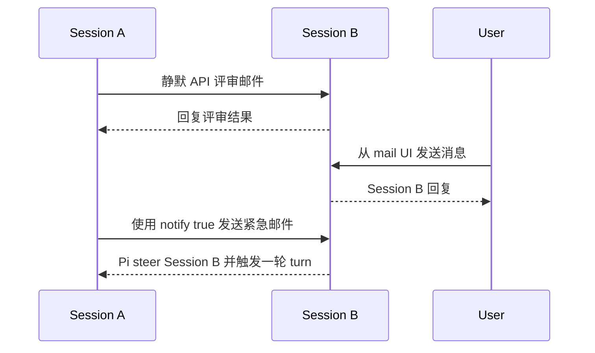

# Pi Mail

[English](./README.md)

**一个本地跨 session 的多 agent 通信基础设施。**

Pi Mail 让同一项目中的独立 Pi session 可以互相收发消息。多个 Agent 分别负责实现、评审、调研、测试或问题排查时，可以通过它保持联系，而不需要合并各自的对话上下文。

## 安装

使用 Pi 安装已经发布的 package：

```bash
pi install npm:pi-mail
```

如果只想在当前项目中安装：

```bash
pi install npm:pi-mail -l
```

也可以直接从 GitHub 安装：

```bash
pi install git:github.com/frostime/pi-mail
```

安装后重启 Pi，或执行 `/reload`。Pi Mail 也可以在 [Pi package gallery](https://pi.dev/packages/pi-mail) 中找到。

## 这个 extension 提供什么

Pi Mail 会向 Pi 注册两个供 Agent 使用的组件：

- 一个内置的 `mail` tool，用于发现 session、收发消息、在线程中回复，以及等待新邮件。
- 一个随包安装的 `pi-mail` skill，用于告诉 Agent 各项邮件操作应该在什么场景下使用，以及如何调用。

这些 tool 调用由 Agent 自己完成。用户不需要手写 tool 参数，也不需要管理邮箱文件。

Pi Mail 同时提供用户侧操作：

- `/mail-ui` 打开当前项目的本地邮箱和写信界面。
- `/mail-reminder` 设置静默邮件长时间未处理时的提醒。
- Pi 底部状态栏显示当前 session 的待处理邮件数量。

## Agent 如何通信

Agent 可以使用注册到 Pi 中的 `mail` tool：

- 查看自己的邮箱身份，并设置易读的 alias；
- 发现当前项目中的其他 Pi session；
- 使用 `To` 和 `Cc` 给一个或多个 session 发消息；
- 查看收件箱、已发送邮件和 conversation thread；
- 回复发件人，或回复 thread 中的所有参与者；
- 在等待另一个 Agent 回复时监听新邮件。

随包提供的 skill 会向 Agent 解释这些操作，因此 Agent 可以在工作过程中自行选择并调用合适的 action。

一个典型流程如下：



### 静默异步通信

普通邮件默认静默投递。收件方可以继续当前工作，在合适的时候再查看消息。Pi 会显示待处理数量，让邮件保持可见，但不会强制打断 Agent。

只要收件方的 mailbox 仍然存在，即使对应 session 暂时离线，邮件也会保留下来。一个 Agent 可以先留下结论或请求，等另一个 session 恢复后再处理。


*静默直接邮件会显示为待处理邮件，Agent 通过 inbox 查看具体内容。*

### 等待回复

如果 Agent 正在等待另一个 session 回复，可以使用 tool 中有限时长的 `wait` action。邮箱中已经有待处理邮件，或等待期间收到新邮件时，`wait` 都会返回，但不会消费邮件；Agent 随后再从 inbox 中读取内容。


*Agent 等待新邮件到达，然后从 inbox 中打开对应消息。*

### 立即提醒

遇到有时效性的消息时，Agent 可以使用 `notify: true` 发送。Pi 会立即把消息呈现给直接 `To` 收件人并触发一轮 turn；`Cc` 收件人仍然保持静默。

这条消息依然会被明确标记为来自另一个 Pi session，而不是用户授权或 permission。


*`notify: true` 会立即把 session 之间的邮件带入收件方当前的 Pi session。*

## 用户可以做什么

用户不需要直接操作 Agent 使用的 `mail` tool。Pi Mail 提供了用于观察和参与项目通信的命令。

### 邮箱 Web UI

在 Pi 中运行：

```text
/mail-ui
```

本地 Web UI 会显示项目邮箱、活跃和离线 session、待处理消息及最近通信。用户可以阅读邮件，也可以给一个、多个或全部活跃 session 发消息。

通过 Web UI 发出的消息会以真实 user message 身份进入目标 Pi session，因此可以和其他 Agent 发来的消息明确区分。

关闭界面：

```text
/mail-ui close
```


*在一个本地页面中查看项目通信，并以用户身份向 session 发消息。*

### 邮件提醒

当前 session 存在待处理邮件时，Pi 底部会显示紧凑的 `mail N` 状态。用户还可以设置：当一封静默直接邮件等待超过指定分钟数时发出提醒。

```text
/mail-reminder 30
/mail-reminder off
```

提醒默认关闭。

## 范围与边界

- 通信范围只限当前项目，包括同一 Git 项目的 linked worktree。
- 邮件保存在本地，不依赖外部消息服务。
- Pi Mail 只提供通信，不负责创建 team、分配任务、启动 Agent 或决定工作流程。
- 来自其他 Agent 的消息不能视为用户确认或授权。

## 开发与详细参考

```bash
npm test
npm run pack:check
```

随包提供的 [`pi-mail` skill](./skills/pi-mail/SKILL.md) 包含完整的 Agent 使用约定；[`extensions/pi-mail/SPEC.md`](./extensions/pi-mail/SPEC.md) 记录贡献者需要维护的模块契约。

## License

GPL-3.0-only. Copyright (c) frostime.
